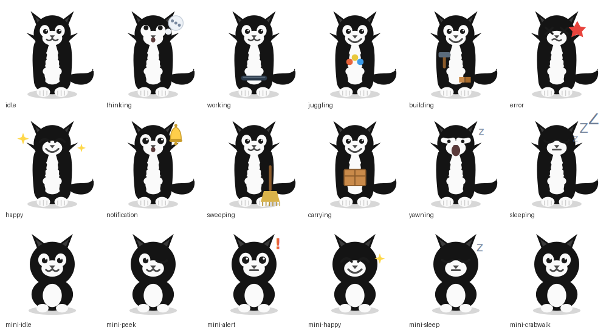

# Dr. Felis — a Clawd desktop pet theme

A tuxedo-cat desktop pet for [clawd-on-desk](https://code.claude.com), built with the
**full feature set** (matching the built-in themes): cursor eye tracking, the full
sleep sequence, multi-session working tiers, subagent juggling, click/drag reactions,
random idle animations, and mini mode. Every asset is an **SVG with CSS animation**, so
it stays crisp at any zoom and needs no GIF tooling.



## What it supports

| Capability | Status |
| --- | --- |
| Eye tracking (cursor follow) | ✅ `idle`, `mini-idle` |
| Sleep sequence | ✅ full — `yawning → dozing → collapsing → sleeping → waking` |
| Working tiers | ✅ `typing` (1) → `juggling` (2) → `building` (3) sessions |
| Juggling (subagents) | ✅ |
| Reactions | ✅ click left/right, annoyed, double, drag (+ left/right) |
| Idle animations | ✅ glance, reading |
| Mini mode | ✅ all 8 states (+ optional `mini-working`) |
| Context / worktree / alerts | ✅ `sweeping`, `carrying`, `notification`, `error` |

## Install

1. Copy the whole `dr-felis/` folder into your Clawd user themes directory:
   - **Windows:** `%APPDATA%/clawd-on-desk/themes/dr-felis/`
   - **macOS:** `~/Library/Application Support/clawd-on-desk/themes/dr-felis/`
   - **Linux:** `~/.config/clawd-on-desk/themes/dr-felis/`
2. Open `Settings...` → `Theme` and select **Dr. Felis**.
3. Restart Clawd if it doesn't appear yet.

## Validate (from the clawd-on-desk repo)

```bash
node scripts/validate-theme.js path/to/dr-felis
```

## Asset map

```
assets/
  idle.svg          # eye-tracking idle (breathe + blink)
  thinking.svg      # thought bubble, looks up
  working.svg       # base — taps a keyboard
  typing.svg        # working tier 1
  juggling.svg      # working tier 2 / subagents — juggles 3 balls
  building.svg      # working tier 3 — hammer + blocks
  error.svg         # dizzy + red spark, shake
  happy.svg         # attention — grin, sparkles, bounce
  notification.svg  # wide eyes, ringing bell
  sweeping.svg      # context compaction — broom
  carrying.svg      # worktree — carries a box
  yawning.svg dozing.svg collapsing.svg sleeping.svg waking.svg   # sleep sequence
  idle-look.svg idle-reading.svg                                  # idle animations
  react-left/right/annoyed/double/drag(-left/-right).svg          # reactions
  mini-*.svg        # 8 mini-mode states (+ mini-working)
```

## Customize / re-generate

The art is generated from small Python scripts so the character stays identical across
every state. To tweak the character (colors, expression, props) edit the generators and
re-run them — they overwrite `assets/`:

```bash
python3 scripts/gen.py        # normal-mode states
python3 scripts/gen_mini.py   # mini-mode states
```

(Prefer hand-editing? Each `.svg` is self-contained — open it and change paths/colors directly.)

## Notes

- Don't rename the folder to `clawd`, `calico`, or `cloudling` — those collide with built-in themes.
- JavaScript inside SVG is stripped from external themes for security; all motion here is
  CSS `@keyframes`, which is allowed.
